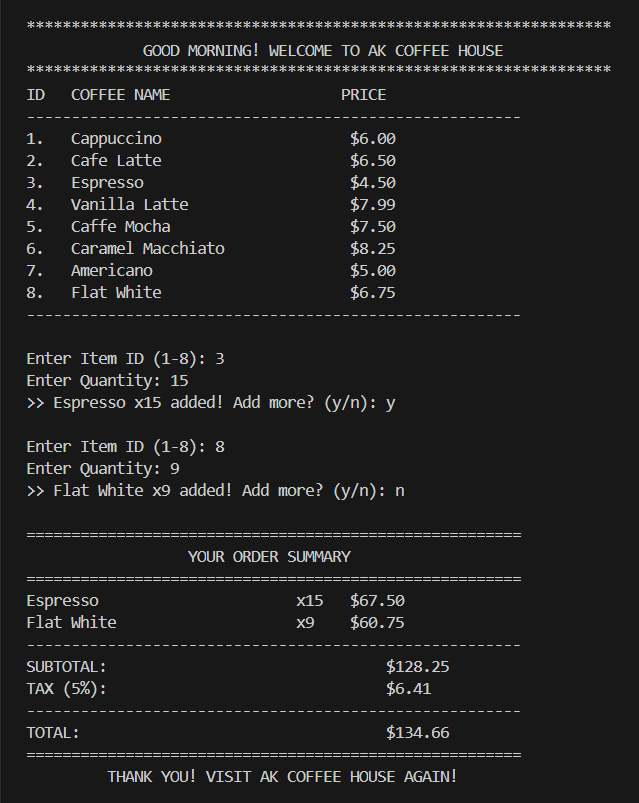
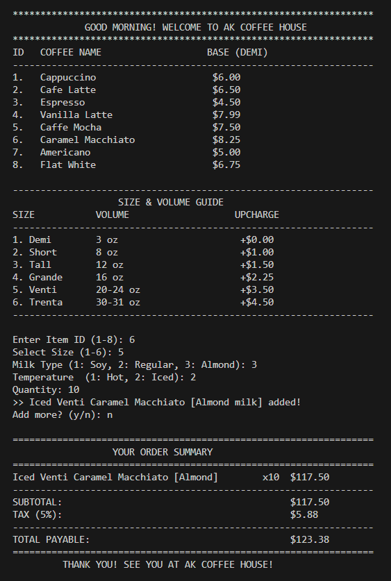
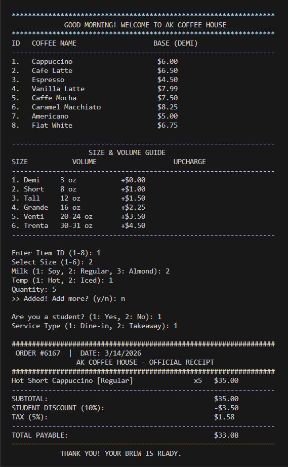
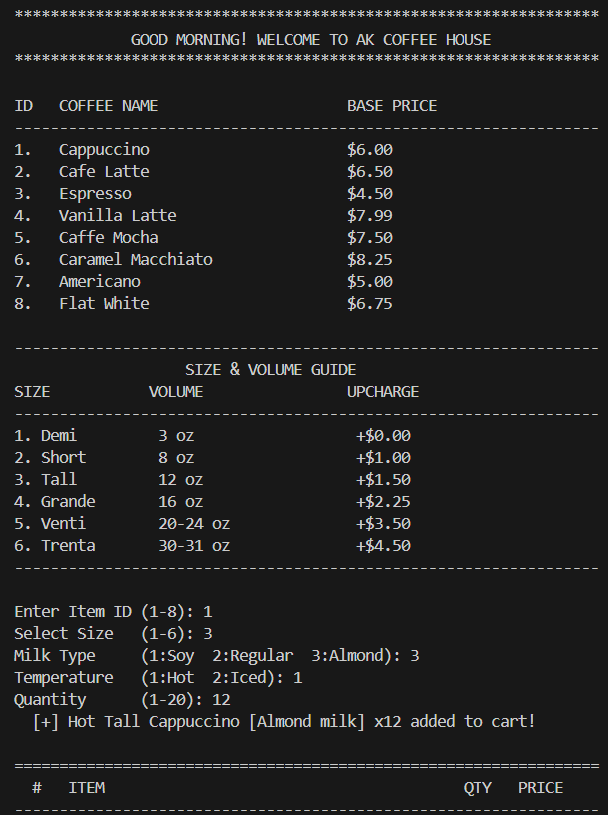
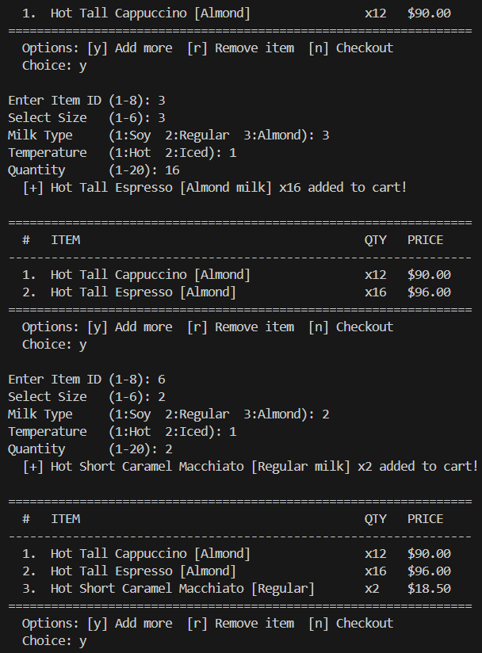
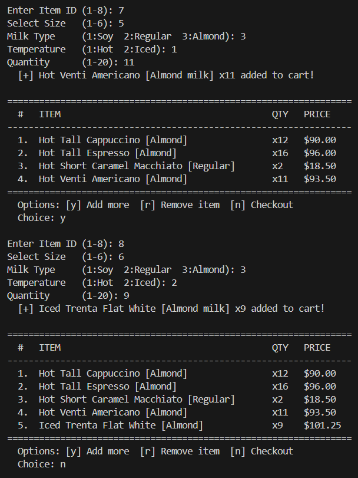
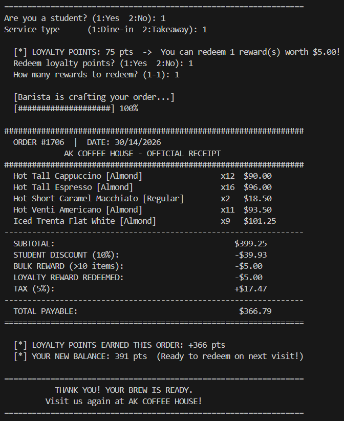

# ☕ Coffee Ordering System

A console-based coffee ordering system built with **C++**, developed progressively across **5 versions** — all inside a single `cafe.cpp` file, tracked using Git tags/releases.

---

## 🗂️ Version History

| Release | What's New |
|---------|-----------|
| [v1.0](https://github.com/Angkon-Kar/coffee-ordering-system/releases/tag/v1.0) | Time-aware greeting, formatted menu display |
| [v2.0](https://github.com/Angkon-Kar/coffee-ordering-system/releases/tag/v2.0) | Item selection, quantity, subtotal + tax |
| [v3.0](https://github.com/Angkon-Kar/coffee-ordering-system/releases/tag/v3.0) | Size upcharge, milk type, temperature, struct/union |
| [v4.0](https://github.com/Angkon-Kar/coffee-ordering-system/releases/tag/v4.0) | Student discount, bulk reward, packaging fee, receipt |
| [v5.0](https://github.com/Angkon-Kar/coffee-ordering-system/releases/tag/v5.0) | **Full experience** — loyalty points, cart management, full validation ⭐ |

> 💡 To see any version's code: go to **Releases** → click a version → download `cafe.cpp`

---

## 🖼️ Output Previews

<details>
<summary>📸 v2.0 — Order Taking + Basic Pricing</summary>

<br>



</details>

<details>
<summary>📸 v3.0 — Size & Customization System</summary>

<br>



</details>

<details>
<summary>📸 v4.0 — Receipt + Discount System</summary>

<br>



</details>

<details>
<summary>📸 v5.0 — Full Experience (Latest ⭐)</summary>

<br>






</details>

---

## ✨ Features (v5.0 — Latest)

- ☕ 8-item menu with size guide (Demi → Trenta)
- 📐 6 size options with dynamic price upcharge
- 🥛 Milk customization: Soy / Regular / Almond
- 🌡️ Temperature: Hot or Iced
- 🎓 Student discount (10% off)
- 📦 Takeaway packaging fee
- 🎁 Bulk order reward (free small cup for >10 items)
- ⭐ **Loyalty Points System** — earn 1 pt/$1, redeem every 50 pts
- 🛒 **Cart Management** — add or remove items before checkout
- ✅ **Full Input Validation** — no crashes on invalid input
- 🧾 Formatted receipt with unique Order ID + date
- ⏳ Animated barista progress bar

---

## 🚀 How to Compile & Run

```bash
g++ -std=c++11 -o cafe cafe.cpp -lpthread
./cafe
```

> Works on Linux, macOS. On Windows use MinGW or WSL.

---

## 📁 Project Structure

```
coffee-ordering-system/
├── cafe.cpp            ← single source file (version controlled via Git tags)
├── Output/
│   ├── v2_output.png
│   ├── v3_output.png
│   ├── v4_output.png
│   ├── v5_output1.png
│   ├── v5_output2.png
│   ├── v5_output3.png
│   └── v5_output4.png
└── README.md
```

---

## 🛠️ Built With

- **Language:** C++11
- **Libraries:** `<iostream>`, `<vector>`, `<iomanip>`, `<thread>`, `<chrono>`, `<ctime>`
- **Concepts Used:** Structs, Unions, Vectors, Switch-case, Input validation, Modular functions

---

## 👤 Author

**Angkon Kar** — Coffee Ordering System  
Feel free to fork, star ⭐, or open an issue!